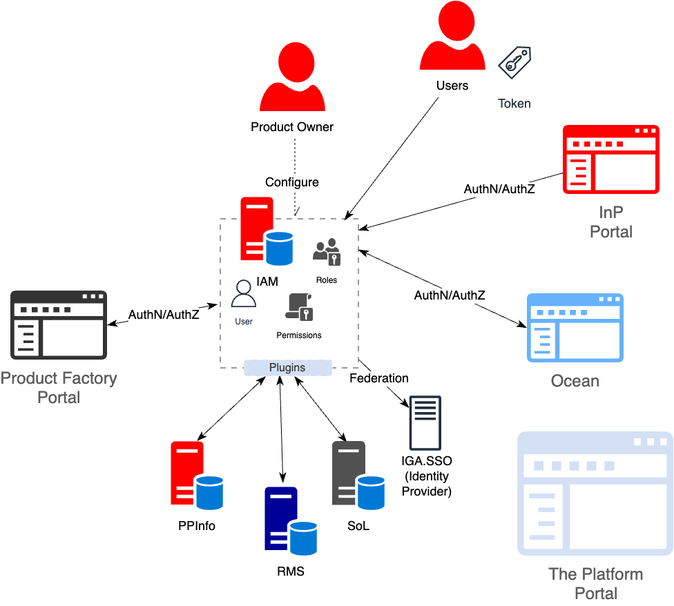

# Общая схема

Для обеспечение единой модели безопасности всех компонентов и сервисов платформы используется централизованный компонет управления доступом пользователей (Identity and Access Management (IAM))

Схема 

# Ключевые термны и определения

**Пользователь** - сотрудник организации, имеющий действующую учетную запись в корпоративном домене и использующий сервисы платформы в рамках выполнения своих задач. Пользователи могут быть двух типов - сотрудники и сервисы (системы).

ВАЖНО. Подсистема IAM в The Platform не является корпоративной системой упрвления доступом, и может интегрироваться с такими копоративными системами в качестве источников пользовательских учетных записей используя стандартные протоколы безопасности (OIDC Federation, SAML Federation и прочее).

**Группа** - логическая группировка пользователей согласно структуры команды, выполняемым функциям и тд. Группы позволяеют управлять разрешениями и политиками доступа для всех пользователей, входящих в состав группы без необходимости делать это на уровне каждого пользователя.

**Роль** - совокупность допустимых действий пользователя в рамках выполняемых им функций и задач.

**Привилегии** - набор разрешений на выполнение каких-либо действий на платформе, доступа к определенным ресурсам и т.д. ()

**Ресур** - "субъект" применения политик безопасност и доступа (например, раздел сайта, сервис, ресурс, и т.д.)

**** - "субъект" применения политик безопасност и доступа (например, раздел сайта, сервис, ресурс, и т.д.)

## Пользователи и группы

## Роли и привилегии

